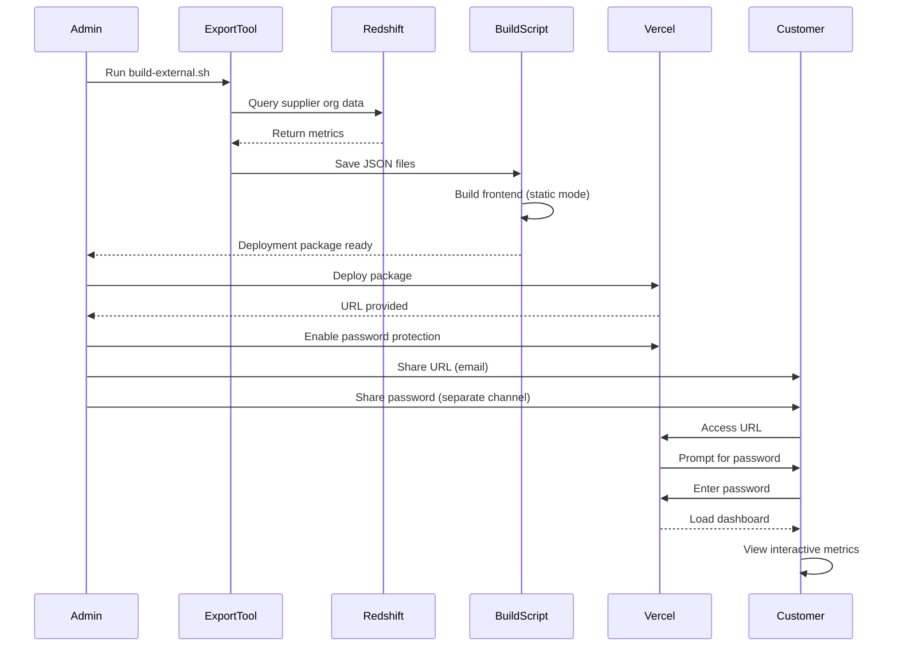

# External Dashboard Sharing - Implementation Notes

**Date:** February 5, 2026  
**Feature:** External dashboard sharing with password protection

## What Was Built

A complete system for sharing interactive, password-protected dashboards with external customers (suppliers, partners, etc.) without exposing internal infrastructure.

## Components Created

### 1. Data Export Tool (`backend/export_external_dashboard.py`)

**Purpose:** Interactive CLI tool to export metrics data for any supplier organization.

**Features:**
- Lists all supplier organizations from database
- Interactive selection with search
- Flexible date range options (30/90/180 days, YTD, custom)
- Exports all dashboard metrics (volume, cycle time, productivity, accuracy)
- Saves to static JSON files
- Validates data before export

**Usage:**
```bash
cd backend
source venv/bin/activate
python3 export_external_dashboard.py
```

**Output:** JSON files in `frontend/public/data/`:
- `metadata.json` - Organization info, date range, export timestamp
- `volume.json` - Fax volume, pages, categories, time-of-day
- `cycle-time.json` - Received-to-open, processing times
- `productivity.json` - Individual performance, daily averages
- `accuracy.json` - Per-field, document-level, trends

### 2. Static Data Mode (Frontend)

**Modified:** `frontend/src/api.ts`

**Changes:**
- Added environment variable check: `VITE_STATIC_DATA`
- When enabled, loads from static JSON files instead of API calls
- Maintains same interface for all API functions
- Seamless switching between live and static modes

**How it works:**
```typescript
const STATIC_MODE = import.meta.env.VITE_STATIC_DATA === 'true';

if (STATIC_MODE) {
  await loadStaticData();
  return staticData.volume?.fax_volume;
}
// Otherwise, make normal API call
```

### 3. Simplified Filter Bar

**Modified:** `frontend/src/components/FilterBar.tsx`

**Changes:**
- Detects static mode automatically
- Shows read-only information instead of interactive filters
- Displays: Organization name, date range, total faxes, export timestamp
- Cleaner, focused UI for external viewers

**Static mode display:**
```
┌─────────────────────────────────────────────────────────┐
│ Organization: Cardinal Health                           │
│ Date Range: Nov 1, 2025 - Feb 5, 2026                  │
│ Total Faxes: 15,234                                     │
│ Exported: Feb 5, 2026 2:30 PM                          │
└─────────────────────────────────────────────────────────┘
```

### 4. Build Automation Script (`scripts/build-external.sh`)

**Purpose:** End-to-end automation for creating deployable packages.

**Features:**
- Validates prerequisites (venv, node_modules)
- Runs data export tool
- Builds frontend with `VITE_STATIC_DATA=true`
- Copies data files to build output
- Creates organized deployment package
- Generates deployment instructions

**Usage:**
```bash
./scripts/build-external.sh
```

**Output:** `external-builds/[org-name]-dashboard-[date]/`
- Complete static site
- All data files included
- `DEPLOY.md` with instructions

### 5. Documentation

**Created:**
- `EXTERNAL_SHARING.md` - Comprehensive guide (step-by-step, security, troubleshooting)
- `scripts/QUICK_REFERENCE.md` - Quick command reference
- `scripts/README.md` - Scripts documentation
- Updated main `README.md` with external sharing section

### 6. Configuration Updates

**`.gitignore`:**
- Added `external-builds/` directory
- Added `frontend/public/data/` directory
- Prevents accidental commit of customer data

## How It Works



## Security Features

### Data Isolation
- ✅ Only selected organization's data exported
- ✅ No access to other suppliers
- ✅ No Redshift credentials in export
- ✅ Aggregated metrics only (no raw documents)

### Access Control
- ✅ Password protection (Vercel server-side)
- ✅ No VPN required for customer
- ✅ Unique password per deployment
- ✅ Easy password rotation

### Best Practices Enforced
- ✅ Separate URL and password communication
- ✅ Strong password generation recommended
- ✅ Access documentation required
- ✅ Periodic password rotation

## Testing Checklist

Before sharing with Cardinal (or first customer):

- [ ] **Test Export Process**
  ```bash
  ./scripts/build-external.sh
  # Select a test organization
  # Verify data files created in frontend/public/data/
  ```

- [ ] **Verify Data Content**
  ```bash
  cat frontend/public/data/metadata.json
  cat frontend/public/data/volume.json | head
  # Confirm correct org, date range, no other supplier data
  ```

- [ ] **Test Local Build**
  ```bash
  cd frontend
  VITE_STATIC_DATA=true npm run build
  npx serve dist
  # Open http://localhost:3000
  # Verify dashboard loads and shows correct data
  ```

- [ ] **Deploy Test Instance**
  ```bash
  cd external-builds/[test-package]
  vercel  # Not --prod for testing
  # Access test URL
  # Verify all metrics display correctly
  ```

- [ ] **Test Password Protection**
  - Enable in Vercel dashboard
  - Test in incognito mode
  - Verify password is required
  - Test correct/incorrect passwords

- [ ] **Review Security**
  - Confirm only test org data visible
  - Check no internal URLs/credentials exposed
  - Verify filter bar shows read-only info
  - Test with non-technical user

## Known Limitations

1. **Static Data Only**
   - Data is a snapshot at export time
   - Must redeploy to update
   - Not real-time

2. **Date Range Fixed**
   - Customer can't change date range
   - Filter bar shows exported range only
   - Would need new export for different dates

3. **Single Organization Only**
   - Each deployment serves one organization
   - Can't compare to other suppliers
   - Multiple customers need multiple deployments

4. **No User Authentication**
   - Single shared password per deployment
   - Can't track individual users
   - No per-user permissions

## Future Enhancements

### Phase 2 (If Needed)
- [ ] Add download/export buttons (CSV, PDF)
- [ ] Include executive summary on landing page
- [ ] Add comparison to industry benchmarks
- [ ] Custom branding per organization

### Phase 3 (If Real-time Needed)
- [ ] Build API with authentication
- [ ] Deploy backend to cloud
- [ ] Issue per-customer API keys
- [ ] Add rate limiting

## Deployment for Cardinal

### Pre-Meeting Checklist

1. **Find Cardinal's ID**
   ```bash
   cd backend && source venv/bin/activate
   python3 -c "from app.database import execute_query; \
   results = execute_query(\"SELECT supplier_organization_id, supplier_organization FROM analytics.intake_documents WHERE LOWER(supplier_organization) LIKE '%cardinal%' GROUP BY 1,2\"); \
   print(results)"
   ```

2. **Determine Date Range**
   - What period to show? (Recommend: Last 90 days for quarterly review)
   - Confirm with team

3. **Run Export**
   ```bash
   ./scripts/build-external.sh
   # Select Cardinal
   # Choose date range
   ```

4. **Deploy**
   ```bash
   cd external-builds/cardinal-*
   vercel --prod
   ```

5. **Security Setup**
   - Enable password protection
   - Generate strong password (use 1Password)
   - Document in team password manager

6. **Share Credentials**
   - Email: URL + context
   - Separate message (Slack DM/SMS): Password
   - Schedule follow-up meeting to review

## Maintenance

### Monthly
- [ ] Review active external dashboards
- [ ] Update data for active customers
- [ ] Check Vercel usage (bandwidth)

### Quarterly  
- [ ] Rotate passwords
- [ ] Review access list
- [ ] Archive old deployments

### As Needed
- [ ] Add new customers (run build-external.sh)
- [ ] Update existing customer data (redeploy)
- [ ] Remove access (delete Vercel project or disable password)

## Support Resources

- **Full Guide:** [EXTERNAL_SHARING.md](EXTERNAL_SHARING.md)
- **Quick Reference:** [scripts/QUICK_REFERENCE.md](scripts/QUICK_REFERENCE.md)
- **Vercel Docs:** https://vercel.com/docs
- **Troubleshooting:** See EXTERNAL_SHARING.md troubleshooting section

## Questions?

Contact the dashboard development team or refer to the comprehensive documentation.

---

## Document Outcomes – Assigned Segmentation (Redshift)

The **Document Outcomes** chart can show Assigned documents split into three bars:

- **Attached to existing order** – document linked to an existing DME order  
- **Generated new order** – document created a new DME order  
- **Assigned (other)** – assigned but neither of the above  

This requires two boolean columns on `analytics.intake_documents` in Redshift. Until they exist (and are backfilled), the API uses a fallback query and the chart shows a single **Assigned** bar.

**Required columns on `analytics.intake_documents`:**

| Column name | Type | Description |
|-------------|------|-------------|
| `is_document_attached_to_existing_dme_order` | BOOLEAN | True when the document was attached to an existing DME order |
| `is_document_generated_new_dme_order` | BOOLEAN | True when the document generated a new DME order |

**Example DDL (run in Redshift after confirming naming with your schema):**

```sql
ALTER TABLE analytics.intake_documents
  ADD COLUMN is_document_attached_to_existing_dme_order BOOLEAN DEFAULT false,
  ADD COLUMN is_document_generated_new_dme_order BOOLEAN DEFAULT false;
```

After adding and backfilling these columns, restart the backend (or rely on reload). The state-distribution query will use them and the Document Outcomes chart will show the three Assigned segments.

**Backend behavior:** If the main query fails with a “column does not exist”–style error, the API falls back to the old query (single Assigned bar) and logs a **WARNING**:  
`State distribution: using fallback (is_document_attached_to_existing_dme_order / is_document_generated_new_dme_order not in Redshift). Document Outcomes will show a single Assigned bar until these columns exist.`  
Check your server/uvicorn console for this WARNING to confirm the fallback is in use.

---

**Implementation Status:** ✅ Complete and ready for production use
**Estimated Time to Deploy for Cardinal:** 15-20 minutes
**Ready for Meeting:** Yes
